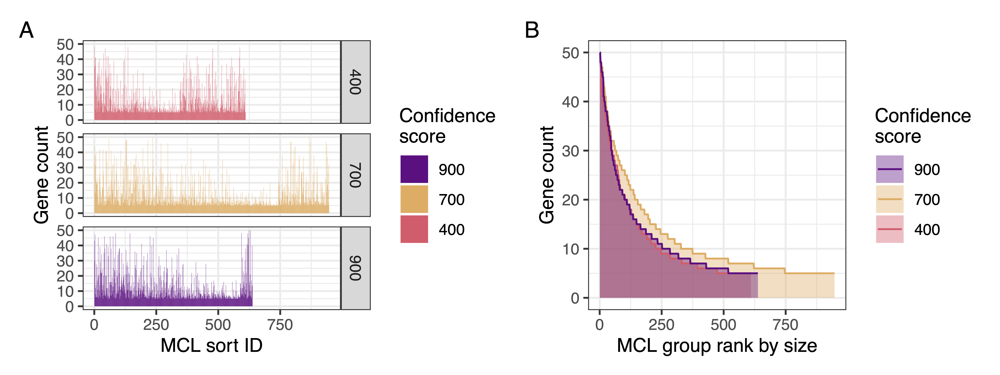
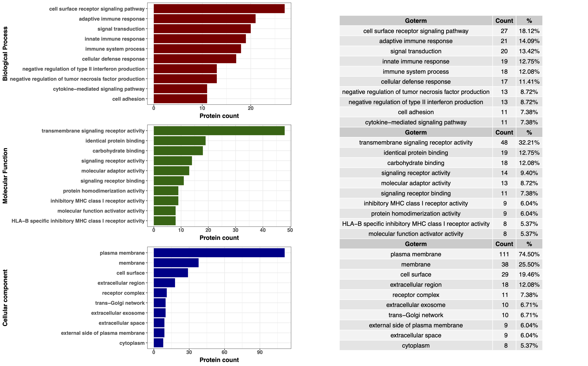
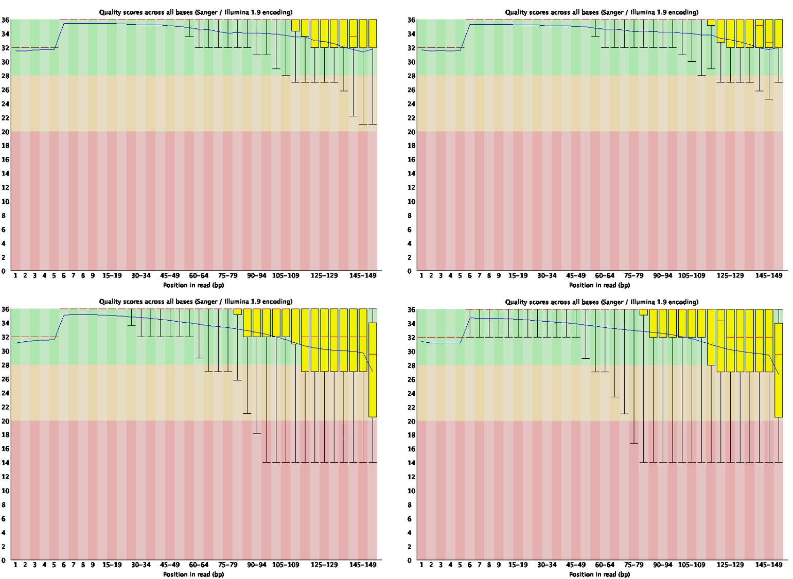
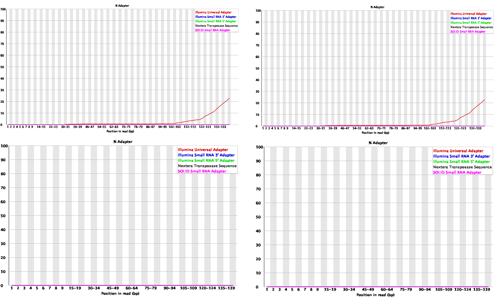

```{css, echo=FALSE}
.kispiblue {
    color: #701A57; /* Replace #ff0000 with your hex color value */
}
```

<style type="text/css">

body{ /* Normal  */
      font-size: 12px;
      <!-- font-family: "Times New Roman", Times, serif; -->
  }
td {  /* Table  */
  font-size: 8px;
}
h1.title {
  font-size: 38px;
  color: black;
}
h1 { /* Header 1 */
  font-size: 28px;
  color: black;
}
h2 { /* Header 2 */
    font-size: 22px;
  color: black;
}
h3 { /* Header 3 */
  font-size: 18px;
  <!-- font-family: "Times New Roman", Times, serif; -->
  color: black;
}
code.r{ /* Code block */
    font-size: 12px;
}
pre { /* Code block - determines code spacing between lines */
    font-size: 14px;
}
</style>


**Author:** <span class="kispiblue">
Dylan Lawless, PhD
</span>


**Affiliation:** Department of Intensive Care and Neonatology, University Children's Hospital Zurich, University of Zurich.


<!-- [Link to PDF version of this report](report.pdf) -->

```{r setup, include=FALSE}
# Define variables, you could also source an R script that outputs these variables
SampleID <- "XYZ_STUDY_D.XYZ003_DNA"
CodingVariant <- "ENST00000380588.4:c.53G>A"
ProteinVariant <- "ENSP00000369962.4:p.Trp18Ter"
ACMGScore <- 2
```

# Introduction

The two datasets (Sample ID: <span class="kispiblue">XYZ_STUDY_D.XYZ003_DNA</span> and reference CH S2) of paired-end short reads were generated from the same human DNA NGS library protocol for clinical diagnosis of phenotype X. Clinical grade sequencing (ISO 15189 accredited) was used to generate whole genome sequence (WGS) data at the Swiss Multi-Omic Center (SMOC) ([SMOC](http://smoc.ethz.ch)). The Illumina Novaseq6000 platform was used in combination with TruSeq DNA PCR-Free library preparation. Analysis was performed with reference to GRCh38. Handling of sensitive clinical data according to established SPHN/BioMedIT guidelines on the sciCORE platform as part of SwissPedHealth ([SPHN/BioMedIT](https://sphn.ch/network/projects/biomedit/)). Herein, we evaluate sample performance for use in clinical diagnosis.

<!-- h2030gc fastq file names: -->
<!-- <SAMPLE_ID>_<NGS_ID>_<POOL_ID>_<S#>_<LANE>_<R1|R2>.fastq.gz -->
<!-- and Illumina fastq header: -->
<!-- @<instrument>:<run number>:<flowcell ID>:<lane>:<tile>:<x-pos>:<y-pos> <read>:<is filtered>:<control number>:<sample number> -->


<pre><code>
h2030gc fastq file names:
&lt;SAMPLE_ID&gt;_&lt;NGS_ID&gt;_&lt;POOL_ID&gt;_&lt;S#&gt;_&lt;LANE&gt;_&lt;R1|R2&gt;.fastq.gz
and Illumina fastq header:
@&lt;instrument&gt;:&lt;run number&gt;:&lt;flowcell ID&gt;:&lt;lane&gt;:&lt;tile&gt;:&lt;x-pos&gt;:&lt;y-pos&gt; &lt;read&gt;:&lt;is filtered&gt;:&lt;control number&gt;:&lt;sample number&gt;
</code></pre>


# Results
## Causal variant summary

- **Sample ID:** <span class="kispiblue">`r SampleID`</span>
- **HGVSc coding variant:** <span class="kispiblue">`r CodingVariant`</span>
- **Protein variant:** <span class="kispiblue">`r ProteinVariant`</span>
- **ACMG score:** <span class="kispiblue">`r ACMGScore`</span>

<!--  -->

```{r load-script, include=FALSE}
# Capture all output to avoid warnings, messages in the output document
suppressWarnings(suppressMessages({
  source("../tests/test_main_filter.R")
}))

# ls()
```


```{r criteria-per-sample, fig.show='hold', out.width='30%', echo=FALSE, results='hide'}
p.criteria_per_sample
p.criteria_count_each_gene
p.criteria_gene_total
p.criteria_per_sample
p.variants_per_criteria
```

```{r results='asis', echo=FALSE}
library(DT)
datatable(dt_selected_sub, options = list(
  dom = 'Bfrtip',
  buttons = c('copy', 'csv', 'excel', 'pdf', 'print'),
  lengthMenu = list(c(10, 25, 50, -1), c('10 rows', '25 rows', '50 rows', 'All')),
  initComplete = JS("function(settings, json) { $(this.api().table().header()).css({'background-color': '#000', 'color': '#fff'}); }")
))
```


## Causal variant evidence interpretation


The analysis of variant interpretation performed by ACMGuru is summarised from the following evidence sources:

Figure: 
<span class="kispiblue">**AutoDestructR Single Case**</span> - This figure includes the use of gene structure and functional data including sources from UniProt, protein structure data from PDB and AlphaFold. 

```{r AutoDestructR-single-case, fig.show='hold', out.width='50%', echo=FALSE}
knitr::include_graphics(c("./images/acmguru/AutoDestructR_singlecase_1.png", "./images/acmguru/AutoDestructR_singlecase_2.png"))
```
Figure: 
<span class="kispiblue">**Protein Pathway Construction Whole Genome V1 Compared**</span>.
This figure includes the use of protein pathway construction from STRING (GO, KEGG, Reactome, etc.). 


Figure: 
<span class="kispiblue">**Combined GO Plots**</span> - This includes biological protein pathway information from GO. 

Figure: 
<span class="kispiblue">**QQ Plot Data from Joint Cohort Analysis**</span> - Contains the QQ plot data from the joint cohort analysis of single variants. 


Figure: 
<span class="kispiblue">**Protein Pathway Network 22**</span> - Contains the protein pathway identified as enriched in patients sharing the same biological mechanism as cause of disease. 

```{r figs-qq-net, fig.show='hold', out.width='50%', echo=FALSE}
knitr::include_graphics(c("./images/acmguru/plink_assoc_ppman_qq.png", "./images/acmguru/ppi_network_22.png"))
```

# Fastq Data

To assess the quality of fastq data, [FastQC](https://www.bioinformatics.babraham.ac.uk/projects/fastqc/) was used. Full HTML reports for each file are linked below:

- [AH\_S1\_L001\_R1\_fastqc](https://lawlessgenomics.com/pages/sophia/AH_S1_L001_R1_fastqc.html)
- [AH\_S1\_L001\_R2\_fastqc](https://lawlessgenomics.com/pages/sophia/AH_S1_L001_R2_fastqc.html)
- [CH\_S2\_L001\_R1\_fastqc](https://lawlessgenomics.com/pages/sophia/CH_S2_L001_R1_fastqc.html)
- [CH\_S2\_L001\_R2\_fastqc](https://lawlessgenomics.com/pages/sophia/CH_S2_L001_R2_fastqc.html)

The results of FastQC were also assessed by use of [fastqcr](https://rpkgs.datanovia.com/fastqcr/index.html). The full HTML report is linked here:
- [Report assessment of FastQC](https://lawlessgenomics.com/pages/sophia/qc_report.html)

## Quality Assessment

1. **Total sequences or the number of reads for each sample:** 1,000,000
2. **Per base sequence quality: All samples performed sufficiently.**
   - Median value (red line): **AH good quality** (qual >28), **CH good quality** (qual >28).
   - Inter-quartile range (25-75%) (yellow box): **AH good quality** (qual >28), **CH medium to good quality** (qual >20).
   - Upper and lower 10% and 90% whiskers points: **AH medium to good quality** (qual >28), **CH poor to good quality** (qual >14).
   - Mean quality (blue line): **AH good quality** (qual >28), **CH medium to good quality** (qual >20).

3. **Per tile sequence quality:** All samples performed sufficiently. No warning.
4. **Per sequence quality score:** All samples performed sufficiently, summarised in the figure below.
5. **Per base sequence content:** All samples flagged with a warning indicating a difference greater than 10% in any position. However, this is potentially due to targeted capturing.
6. **Per sequence GC content:** All samples failed based on modal GC content as calculated from the observed data and used to build a reference distribution. The sum of the deviations from the normal distribution represents more than 30% of the reads. However, the sharp peaks are most likely due to enriched duplicate sequences from targeted capturing and do not necessarily indicate poor quality.
7. **Sequence Length Distribution:** AH reads were all 150, while CH reads were 35-151.
8. **Sequence Duplication Levels:** Percentage of duplicate reads were **AH 96.01%-96.55%** and **CH 65.44%-67.13%**.
9. **Adapter Content:** Detailed below.

## Figures

```{r figure1, echo=FALSE, fig.cap="Per base sequence quality score: [Top] AH [Bottom] CH. AH outperformed CH for both reads. Central red line shows the median value. Inter-quartile range 25-75% (yellow box). Upper and lower whiskers represent the 10% and 90% points. Mean quality (blue line)."}



```


# Alignment Data

Fastq files were trimmed using [TrimGalore](https://www.bioinformatics.babraham.ac.uk/projects/trim_galore/) with the use of [cutadapt](https://github.com/marcelm/cutadapt).

Reads were aligned to GRCh37 using [BWA MEM](http://bio-bwa.sourceforge.net) and converted to bam format with [samtools](http://www.htslib.org).

The alignment data was assessed using:

- [samtools flagstat](http://www.htslib.org): get mapping summary.
- [samtools depth](http://www.htslib.org): read depth for all positions of the reference genome, e.g., how many reads are overlapping the genomic position.
- [qualimap](http://qualimap.conesalab.org): examines sequencing alignment data in SAM/BAM files and provides an overall view of the data that helps to detect biases in the sequencing and/or mapping of the data.

Qualimap full HTML report links:
- [Sample AH](https://lawlessgenomics.com/pages/sophia/AH_S1_L001.sort_stats/qualimapReport.html)
- [Sample CH](https://lawlessgenomics.com/pages/sophia/CH_S2_L001.sort_stats/qualimapReport.html)

## Alignment Summary

1. **Samtools flagstat mapping summary** shows alignment performance with GRCh37 for sorted reads, detailed in the table below.
2. **Mapping quality histogram** indicates that AH performed better than CH.
3. **Genome coverage histogram** shows that AH produced a normal distribution of coverage depths while CH had an enrichment for some genomic regions.
4. **The duplication rate histograms** are shown below.
5. **Genome coverage across GRCh37** shows a uniform distribution of reads for AH [Top], while CH [Bottom] has high depth in some regions with lower coverage in others.

## Tables and Figures

```{r flagstat-table, echo=FALSE, results='asis'}
library(knitr)
# Create a data frame for the table content
flagstat_data <- data.frame(
  Metric = c("In total (QC-passed reads & + QC-failed reads)", "Secondary", "Supplementary", 
             "Duplicates", "Mapped (99.76% : N/A, 99.92% : N/A)", "Paired in sequencing",
             "Read1", "Read2", "Properly paired (98.64% : N/A, 99.69% : N/A)",
             "With itself and mate mapped", "Singletons (0.20% : N/A, 0.02% : N/A)",
             "With mate mapped to a different chr", "With mate mapped to a different chr (mapQ>=5)"),
  CH = c("2011262", "15710", "0", "0", "2006501", "1995552", "997776", "997776",
         "1968314", "1986886", "3905", "14488", "8748"),
  AH = c("1999498", "612", "0", "0", "1997929", "1998886", "999443", "999443",
         "1992738", "1996840", "477", "1612", "1426")
)

kable(flagstat_data, caption = "Samtools flagstat mapping summary. Alignment with GRCh37, sorted reads.")

```


## Mapping Quality Histogram
```{r figs-qual, fig.show='hold', out.width='50%', echo=FALSE}
knitr::include_graphics(c("./images/qualimap/AH_S1_L001.sort_stats/images_qualimapReport/genome_mapping_quality_histogram.png", "./images/qualimap/CH_S2_L001.sort_stats/images_qualimapReport/genome_mapping_quality_histogram.png"))
```

## Genome Coverage Histogram
```{r figs-cov, fig.show='hold', out.width='50%', echo=FALSE}
knitr::include_graphics(c("./images/qualimap/AH_S1_L001.sort_stats/images_qualimapReport/genome_coverage_histogram.png", "./images/qualimap/CH_S2_L001.sort_stats/images_qualimapReport/genome_coverage_histogram.png"))
```

## Duplication Rate Histogram
```{r figs-dups, fig.show='hold', out.width='50%', echo=FALSE}
knitr::include_graphics(c("./images/qualimap/AH_S1_L001.sort_stats/images_qualimapReport/genome_uniq_read_starts_histogram.png", "./images/qualimap/CH_S2_L001.sort_stats/images_qualimapReport/genome_uniq_read_starts_histogram.png"))
```

## Genome Coverage Across Reference
```{r figs-ref, fig.show='hold', out.width='50%', echo=FALSE}
knitr::include_graphics(c("./images/qualimap/AH_S1_L001.sort_stats/images_qualimapReport/genome_coverage_across_reference.png", "./images/qualimap/CH_S2_L001.sort_stats/images_qualimapReport/genome_coverage_across_reference.png"))
```


# About
[This document's source code is available from the GitHub repository](https://github.com/DylanLawless/kit_assess/blob/master/latex/report.tex).

All code used in this report is available on the [GitHub repository](https://github.com/DylanLawless/kit_assess).
